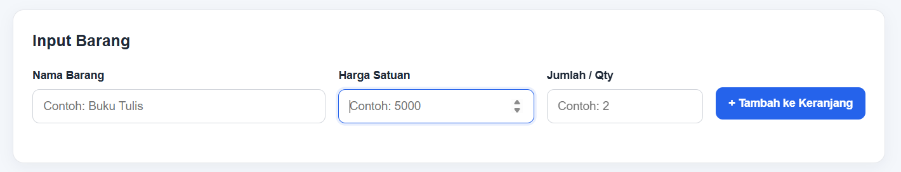
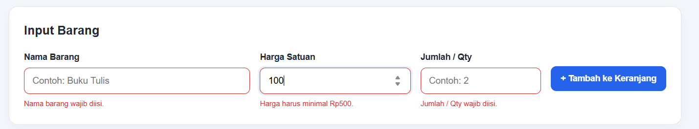
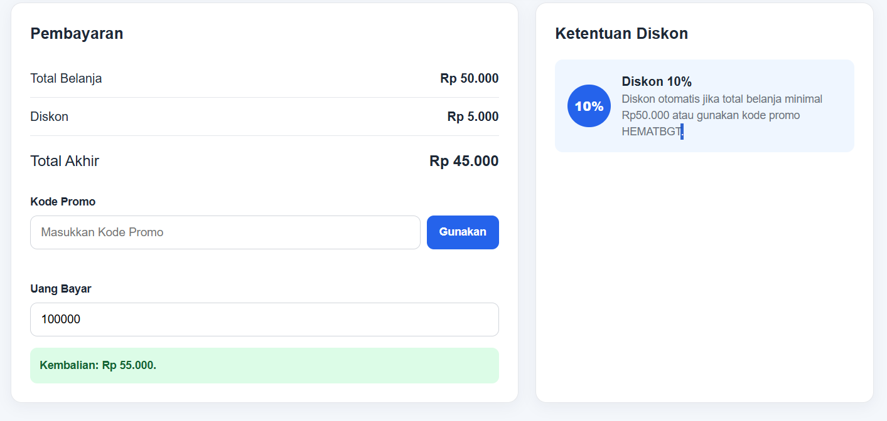

# Mini POS – Kasir & Keranjang Belanja Sederhana

## Identitas

* **Nama Lengkap :** *Diki Hurrisyail*
* **NIM :** *124140088*
* **Kelas Praktikum :** *Isi sesuai kelas*

## Deskripsi Aplikasi

Aplikasi web **Kasir & Keranjang Belanja Sederhana (Mini POS)** untuk kasir kantin / toko kampus. Kasir dapat memasukkan barang, melihat daftar belanja, mendapat diskon otomatis atau menggunakan kode promo, serta menghitung uang kembalian. Isi keranjang disimpan di `localStorage` sehingga tidak hilang saat halaman di-refresh.

Studi kasus yang dipilih: **kasir kantin kampus**.

## Panduan Menjalankan

1. Clone / unduh repository ini.
2. Buka folder `diki_hurrisyail_124140088_pertemuan1` di VS Code.
3. Klik kanan `index.html` → **Open with Live Server**.
4. Aplikasi akan terbuka di browser.
5. Latihan modul disimpan di folder `modul/`.

## Struktur Folder

```text
diki_hurrisyail_124140088_pertemuan1/

├── index.html          # Struktur halaman utama
├── style.css           # Tampilan halaman
├── script.js           # Logika aplikasi
├── README.md           # Dokumentasi proyek
│
├── modul/              # Latihan praktikum
│   └── file latihan
│
└── screenshot/         # Dokumentasi screenshot
    ├── form.png
    ├── error.png
    └── transaksi.png
```

## Daftar Fitur

* [x] Validasi nama barang (wajib, minimal 3 karakter)
* [x] Validasi harga satuan (angka, minimal Rp500)
* [x] Validasi qty (bilangan bulat, minimal 1)
* [x] Pesan error merah di bawah input yang salah
* [x] Barang tidak masuk keranjang jika input tidak valid
* [x] Form otomatis di-reset setelah barang berhasil ditambahkan
* [x] Tombol naik/turun harga dengan perubahan Rp1.000
* [x] Subtotal per barang (harga × qty)
* [x] Total belanja otomatis
* [x] Diskon 10% otomatis jika total ≥ Rp50.000
* [x] Kode promo `HEMATBGT` untuk mendapatkan diskon 10%
* [x] Menampilkan nominal diskon dan total akhir
* [x] Uang bayar & kembalian otomatis
* [x] Pesan "uang belum mencukupi" jika uang kurang
* [x] Tabel keranjang (No, Nama Barang, Harga Satuan, Qty, Subtotal, Aksi)
* [x] Tombol Hapus per item
* [x] Total & diskon dihitung ulang setelah item dihapus
* [x] Penyimpanan keranjang di localStorage (`JSON.stringify` / `JSON.parse`)
* [x] Tombol Transaksi Baru / Reset
* [x] Mengosongkan keranjang & localStorage
* [x] Format Rupiah
* [x] Tampilan responsif

## Tangkapan Layar

> Ganti dengan screenshot milik sendiri (minimal 3).

| Tampilan                  | Gambar                                       |
| ------------------------- | -------------------------------------------- |
| Form input utama          |            |
| Validasi error muncul     |       |
| Hasil perhitungan & tabel |  |

## Penjelasan Teknis Singkat

**Validasi input.** Fungsi `validateForm()` memeriksa tiga input. Nama di-`trim()` lalu dicek panjangnya ≥ 3. Harga diubah dengan `Number()` dan harus minimal Rp500. Qty harus `Number.isInteger()` dan minimal 1. Jika ada yang salah, pesan merah ditampilkan di bawah input terkait dan fungsi mengembalikan `false` sehingga barang tidak ditambahkan.

**Kalkulator.** Subtotal dihitung dengan rumus harga × qty. Total belanja menjumlahkan seluruh subtotal menggunakan `reduce()`. Diskon 10% diberikan jika total belanja minimal Rp50.000 atau jika kode promo `HEMATBGT` digunakan. Total akhir dihitung dengan rumus total belanja − diskon. Kembalian dihitung dari uang bayar − total akhir. Jika uang bayar kurang, sistem menampilkan pesan bahwa uang belum mencukupi.

**Harga barang.** Input harga menggunakan `step="1000"` sehingga tombol naik/turun pada input angka dapat mengubah harga dengan kelipatan Rp1.000.

**localStorage.** Setiap perubahan keranjang memanggil fungsi penyimpanan yang menyimpan array menggunakan `JSON.stringify()`. Saat halaman dibuka, data keranjang dibaca menggunakan `JSON.parse()`. Dengan begitu, isi keranjang tetap tersedia setelah halaman di-refresh. Tombol transaksi baru menghapus data menggunakan `localStorage.removeItem()`.

**Reset transaksi.** Tombol `Transaksi Baru` mengosongkan isi keranjang, membersihkan `localStorage`, menghapus kode promo, dan mengembalikan form ke kondisi awal.
